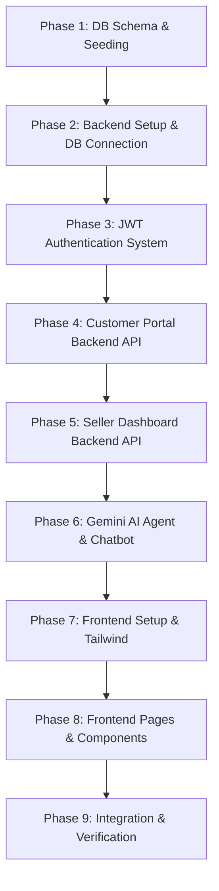

# Implementation Plan - ReturnIQ (AI Returns Intelligence for EliteMart)

ReturnIQ is a full-stack AI-powered return intelligence platform built for **EliteMart** (a fictional single-seller multi-category e-commerce platform). It consists of a React frontend, Node.js + Express backend, MySQL database, and Gemini-based AI agent/chatbot features.

---

## User Review Required

We need to align on a few initial choices before writing code:
1. **Tailwind CSS Version**: The specification mentions Tailwind CSS. We recommend using **Tailwind CSS v3** (with standard setup in Vite) or **Tailwind CSS v4** depending on your preference.
2. **Database Credentials**: We will default to:
   - Host: `localhost`
   - Port: `3306`
   - User: `root`
   - Password: `root123`
   - Database name: `returniq` (Let us know if you want to use a different database name or port).
3. **Gemini API Configuration**: To use the Gemini API for the AI Agent and Chatbot, we need a Gemini API Key. We will place a placeholder `GEMINI_API_KEY` in the `.env` file for you to configure, or you can provide one.
4. **Cloudinary Configuration**: For return image uploads, we will need `CLOUDINARY_CLOUD_NAME`, `CLOUDINARY_API_KEY`, and `CLOUDINARY_API_SECRET`. We will write a utility that falls back to a mock local file upload if these credentials are not set, so the app remains fully functional without Cloudinary configured.

---

## Open Questions

- **Database Name**: Is `returniq` a good name for the database, or would you prefer to overwrite/use the existing `supply_chain` or another database?
- **Seed Products**: The specification asks for 10-12 seeded products across Electronics, Fashion/Clothing, Home & Kitchen, Accessories, and Footwear. Do you have specific names or categories you'd like, or can we design a set of realistic products with specific returns histories (e.g., shoe sizing issues, clothing color mismatch, electronics DOA)?

---

## Proposed Changes & Step-by-Step Flow

To ensure a thorough learning process, we will build the application step-by-step. Each file will be created, explained, and verified before moving to the next.

### Component 1: Database (MySQL)
We will create a `database/` folder inside the workspace `c:\Users\Karve\OneDrive\Desktop\ReturnIQ` containing:
- #### [NEW] [schema.sql](file:///c:/Users/Karve/OneDrive/Desktop/ReturnIQ/database/schema.sql)
  Defines the database and the tables:
  1. `users`: ID, login_id (email), display_name, role ('customer', 'seller'), password_hash, refresh_token (optional, or stored in cookie), created_at.
  2. `products`: ID, name, category, price, description, image_url, return_health_score, created_at.
  3. `orders`: ID, user_id (customer), product_id, order_date, price, quantity, status (e.g., 'delivered', 'returned').
  4. `returns`: ID, order_id, product_id, customer_id, return_date, return_reason, detailed_notes, image_url, status ('pending', 'approved', 'rejected', 'manual_review'), ai_risk_score, ai_recommendation, ai_insight, ai_explanation, ai_confidence, created_at.
  5. `reviews`: ID, product_id, customer_id, rating, review_text, review_date, created_at.
  6. `chat_history`: ID, user_id, message, sender ('user', 'ai'), created_at.

- #### [NEW] [seed.sql](file:///c:/Users/Karve/OneDrive/Desktop/ReturnIQ/database/seed.sql)
  Seeds 10-12 products across Electronics, Fashion, Home, Accessories, and Footwear with matching orders, reviews, and returns.

---

### Component 2: Backend (Node.js & Express)
We will create a `backend/` folder:
- #### [NEW] [package.json](file:///c:/Users/Karve/OneDrive/Desktop/ReturnIQ/backend/package.json)
  Contains dependencies: `express`, `mysql2/promise`, `jsonwebtoken`, `bcryptjs`, `dotenv`, `cors`, `multer`, `cloudinary`, and `@google/genai` (or alternative Google AI SDK).
- #### [NEW] [.env](file:///c:/Users/Karve/OneDrive/Desktop/ReturnIQ/backend/.env)
  Stores environment variables.
- #### [NEW] [db.js](file:///c:/Users/Karve/OneDrive/Desktop/ReturnIQ/backend/db.js)
  Establishes a MySQL connection pool using promise-based `mysql2`.
- #### [NEW] [auth-utils.js](file:///c:/Users/Karve/OneDrive/Desktop/ReturnIQ/backend/auth-utils.js)
  JWT generation, verification, and password hashing using `bcryptjs`.
- #### [NEW] [routes/auth.js](file:///c:/Users/Karve/OneDrive/Desktop/ReturnIQ/backend/routes/auth.js)
  Routes for registering customers and logging in (JWT tokens creation).
- #### [NEW] [routes/customer.js](file:///c:/Users/Karve/OneDrive/Desktop/ReturnIQ/backend/routes/customer.js)
  Endpoints for products, past orders, submitting returns, reviews, and fetching return status.
- #### [NEW] [routes/seller.js](file:///c:/Users/Karve/OneDrive/Desktop/ReturnIQ/backend/routes/seller.js)
  Endpoints for viewing returns, analytics (trends/reasons), updating/overriding return status.
- #### [NEW] [routes/ai.js](file:///c:/Users/Karve/OneDrive/Desktop/ReturnIQ/backend/routes/ai.js)
  Endpoints for the AI Return Agent evaluation and the Chatbot.
- #### [NEW] [ai-agent.js](file:///c:/Users/Karve/OneDrive/Desktop/ReturnIQ/backend/ai-agent.js)
  Implements the agent tool-calling loop using Gemini. Define tools: `getCustomerReturnHistory`, `getOrderDetails`, `checkReasonConsistency`, `getProductReturnStats`, and `getProductReviews`.
- #### [NEW] [server.js](file:///c:/Users/Karve/OneDrive/Desktop/ReturnIQ/backend/server.js)
  Main application entry point.

---

### Component 3: Frontend (React & Tailwind CSS)
We will initialize the frontend in a `frontend/` directory using Vite + React.
- #### [NEW] [package.json](file:///c:/Users/Karve/OneDrive/Desktop/ReturnIQ/frontend/package.json)
  Frontend package configuration with `react`, `react-router-dom`, `axios`, `lucide-react` for icons, and chart utilities (e.g. `recharts` for seller analytics).
- #### [NEW] [tailwind.config.js](file:///c:/Users/Karve/OneDrive/Desktop/ReturnIQ/frontend/tailwind.config.js) & [src/index.css](file:///c:/Users/Karve/OneDrive/Desktop/ReturnIQ/frontend/src/index.css)
  Styling setup for premium UI (using Tailwind CSS).
- #### [NEW] [src/App.jsx](file:///c:/Users/Karve/OneDrive/Desktop/ReturnIQ/frontend/src/App.jsx)
  Root component with routing (Login, Register, Customer Dashboard, Seller Dashboard).
- #### [NEW] [src/pages/Login.jsx](file:///c:/Users/Karve/OneDrive/Desktop/ReturnIQ/frontend/src/pages/Login.jsx) & [Register.jsx](file:///c:/Users/Karve/OneDrive/Desktop/ReturnIQ/frontend/src/pages/Register.jsx)
  Auth pages.
- #### [NEW] [src/pages/CustomerPortal.jsx](file:///c:/Users/Karve/OneDrive/Desktop/ReturnIQ/frontend/src/pages/CustomerPortal.jsx)
  Customer dashboard: view products with Return Health Score, view orders, request returns, write reviews, and open AI Chat.
- #### [NEW] [src/pages/SellerDashboard.jsx](file:///c:/Users/Karve/OneDrive/Desktop/ReturnIQ/frontend/src/pages/SellerDashboard.jsx)
  Seller dashboard: lists return requests, displays AI risk/recommendations/explanations, provides override buttons, and renders analytics charts.

---

## Verification Plan

We will verify each component as it is built:

### Automated/Diagnostic Verification
- **Database**: Run standard queries using database client or small script to verify tables are created and seeded correctly.
- **Backend APIs**: Use backend health endpoints and test requests (e.g. using `curl` or diagnostic script) to check `/api/auth`, `/api/customer`, and `/api/seller` routes.
- **AI Agent & Chatbot**: Write a diagnostic script to dry-run the Gemini tool loop and chatbot with mocked database returns to verify tool-calling works correctly.

### Manual Verification
- Deploying frontend and backend locally (`npm run dev`), logging in as Customer to submit return and review, logging in as Seller to check recommendation, analytics, and override behavior.
